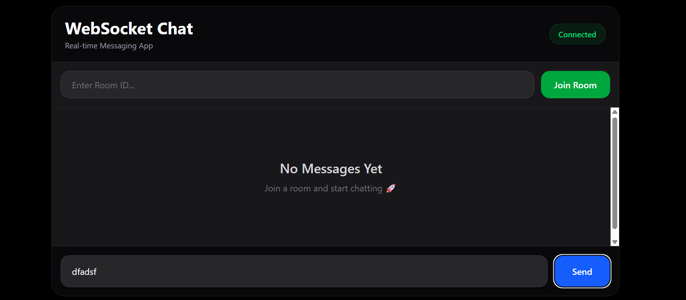

# WebSocket Chat App

A real-time messaging application built with React, TypeScript, and WebSockets. This project demonstrates modern web development practices with a responsive UI and real-time communication capabilities.



## 🚀 Features

- **Real-time Messaging**: Instant message delivery using WebSocket protocol
- **Room-based Chat**: Join different chat rooms for organized conversations
- **Live Connection Status**: Visual indicator showing WebSocket connection status
- **Auto-scroll**: Messages automatically scroll to the latest message
- **Clean UI**: Modern, dark-themed interface built with React and styled with CSS
- **TypeScript Support**: Fully typed for better development experience

## 📁 Project Structure

```
websocket-chat-app/
├── package.json                 # Root project configuration
├── tsconfig.json               # TypeScript root configuration
├── src/                        # Backend source files
│   ├── index.ts               # Main backend entry point
│   └── index2.ts              # WebSocket server implementation
└── chat-app/                   # React frontend application
    ├── package.json           # Frontend dependencies
    ├── index.html             # HTML template
    ├── vite.config.ts         # Vite configuration
    ├── tsconfig.json          # Frontend TypeScript config
    ├── public/                # Static assets
    │   ├── screenshots/       # Application screenshots
    │   └── ...
    └── src/
        ├── App.tsx            # Main React component
        ├── App.css            # Component styles
        ├── main.tsx           # React entry point
        ├── index.css          # Global styles
        └── assets/            # Component assets
```

## 🛠️ Tech Stack

### Frontend

- **React 19.2.6** - UI library
- **TypeScript 6.0.2** - Type-safe development
- **Vite 8.0.12** - Fast build tool
- **ESLint** - Code linting and quality

### Backend

- **Node.js** - JavaScript runtime
- **WebSocket (ws 8.21.0)** - Real-time communication library
- **TypeScript 6.0.3** - Type-safe backend code

## 📋 Prerequisites

- **Node.js** (v16 or higher recommended)
- **npm** or **yarn** package manager

## 🚀 Getting Started

### 1. Install Dependencies

```bash
# Install root dependencies
npm install

# Install frontend dependencies
cd chat-app
npm install
cd ..
```

### 2. Start the Development Environment

Open two terminal windows:

**Terminal 1 - Start the WebSocket Server:**

```bash
npm run dev
```

**Terminal 2 - Start the React Development Server:**

```bash
cd chat-app
npm run dev
```

The frontend will be available at `http://localhost:5173` (or the port Vite assigns)

The backend WebSocket server runs on `ws://localhost:8001`

## 📱 How to Use

1. **Connect**: The app automatically connects to the WebSocket server on startup
2. **Join a Room**: Enter a Room ID in the input field and click "Join Room"
3. **Send Messages**: Type a message and click "Send" to share with others in the room
4. **View Messages**: Messages appear in real-time in the chat window
5. **Connection Status**: Check the "Connected" indicator in the top-right corner

## 🏗️ Building for Production

```bash
cd chat-app
npm run build
```

The built files will be in the `chat-app/dist` directory.

## 🧹 Code Quality

Run ESLint to check code quality:

```bash
cd chat-app
npm run lint
```

## 📡 WebSocket Protocol

The application uses a JSON-based protocol for WebSocket communication:

### Join Room Message

```json
{
  "type": "join",
  "payload": {
    "roomId": "room-name"
  }
}
```

### Send Chat Message

```json
{
  "type": "chat",
  "payload": {
    "message": "Your message here"
  }
}
```

## 🔧 Configuration

- **WebSocket Server URL**: `ws://localhost:8001` (configured in [App.tsx](chat-app/src/App.tsx))
- **Frontend Port**: `5173` (default Vite port, configurable in vite.config.ts)
- **Backend Port**: `8001` (configurable in backend server)

## 🎨 UI Components

- **Header**: Displays app title and connection status
- **Room Input**: Allows users to enter and join chat rooms
- **Message Display**: Shows chat history with auto-scroll
- **Message Input**: Text input with send button

## 📚 Available Scripts

### Root Project

- `npm run dev` - Start the WebSocket server
- `npm test` - Run tests (placeholder)

### Frontend (chat-app)

- `npm run dev` - Start development server
- `npm run build` - Build for production
- `npm run lint` - Run ESLint
- `npm run preview` - Preview production build

## 🐛 Troubleshooting

### WebSocket Connection Failed

- Ensure the backend server is running on port 8001
- Check firewall settings
- Verify the WebSocket URL in [App.tsx](chat-app/src/App.tsx)

### Messages Not Appearing

- Confirm you've joined a room
- Check browser console for errors
- Verify WebSocket connection status indicator

### Port Already in Use

- Change the port in the server configuration
- Update the WebSocket URL in the frontend accordingly

## 🚀 Future Enhancements

- [ ] User authentication and profiles
- [ ] Direct messaging between users
- [ ] Message persistence and history
- [ ] File sharing capabilities
- [ ] Message reactions and emoji support
- [ ] Typing indicators
- [ ] Read receipts
- [ ] Mobile app version

## 📄 License

ISC License

## 👤 Author

Created as a demonstration of WebSocket-based real-time communication with React and TypeScript.

---

**Note**: To use this application, make sure both the backend WebSocket server and the frontend React application are running simultaneously.
